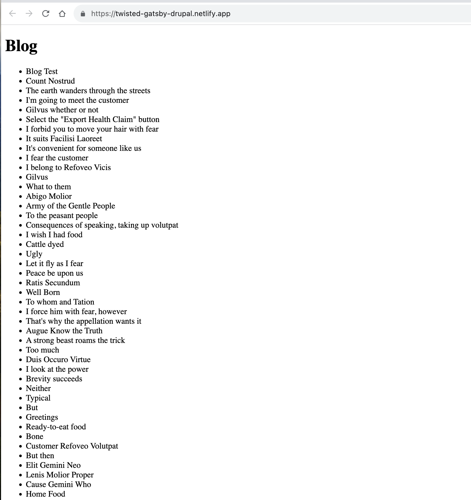

# Drupal Gatsby Sandbox Project

This project combines the power of Drupal, a robust and flexible content management system, with Gatsby, a modern web framework for building fast websites and applications. By integrating Drupal as a headless CMS with Gatsby, you can create dynamic and performant websites that are easy to manage and scale.

## Screenshots

## Tech Stack

Built with JavaScript, React, and GraphQL.

## Features

- COMING SOON

## Status
    WORK IN PROGRESS
## FAQ

#### Questions to come...

...as soon as I have the answers.

## Authors

- [@twistedstack](https://www.github.com/twistedstack)

## 🔗 Links

